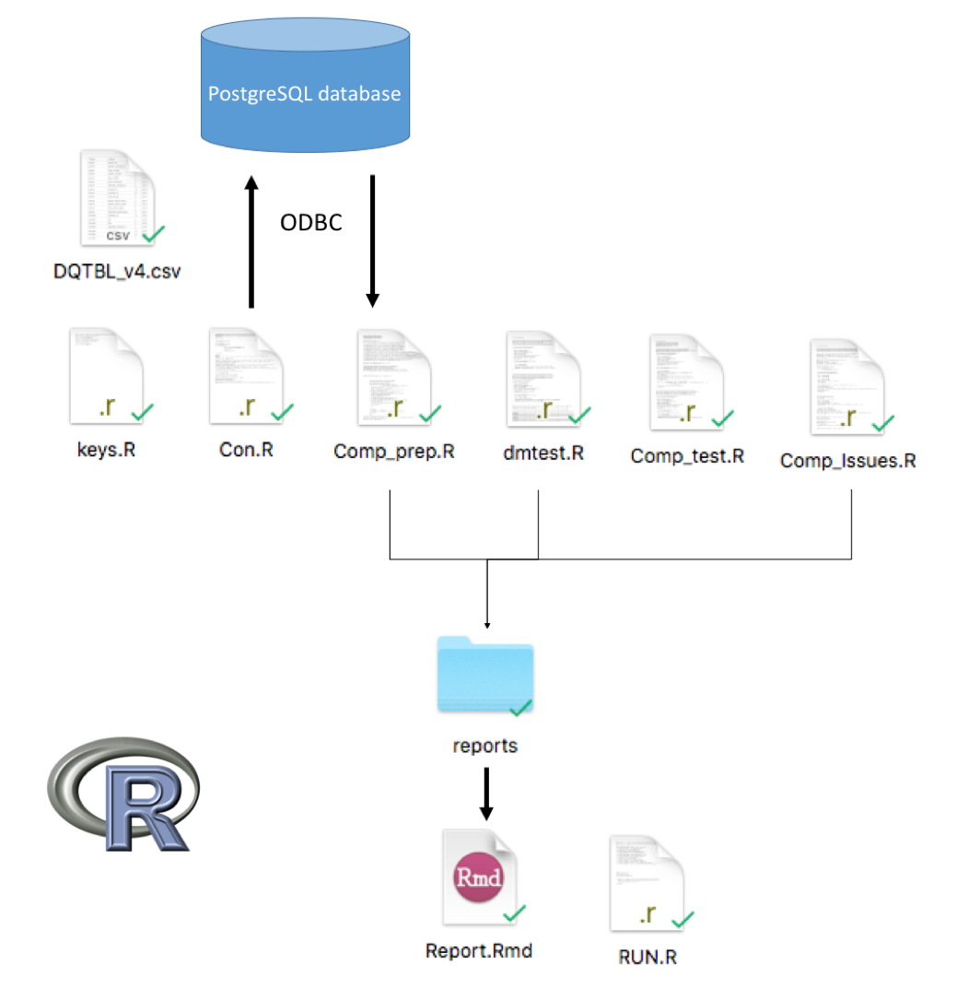

###Introduction
This document is a guide to run DQe-c program. DQe-c program is a component of the DQe project (Data Quality Explorer) that evaluates completeness in clinical data. The version of DQe-c described in this document is customized for OMOP version 4 common data model.

###Program Elements and Flows
Figure 1 visualizes the workflow for DQe-c.

Figure 1. DQe-c Workflow

###Contact
for questions and/or inquiries contact `hestiri at uw . edu`
